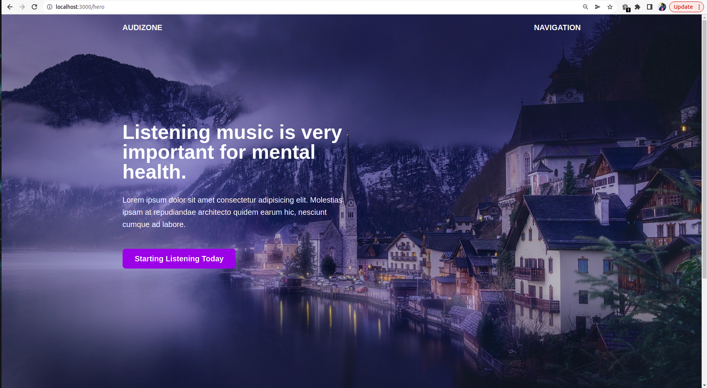
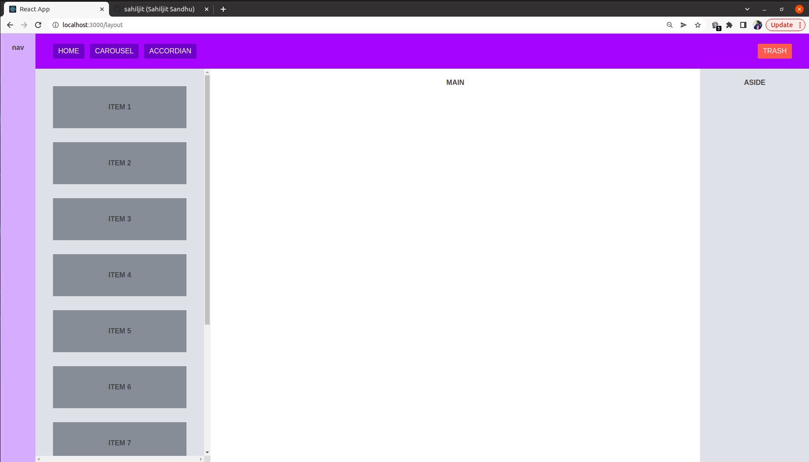
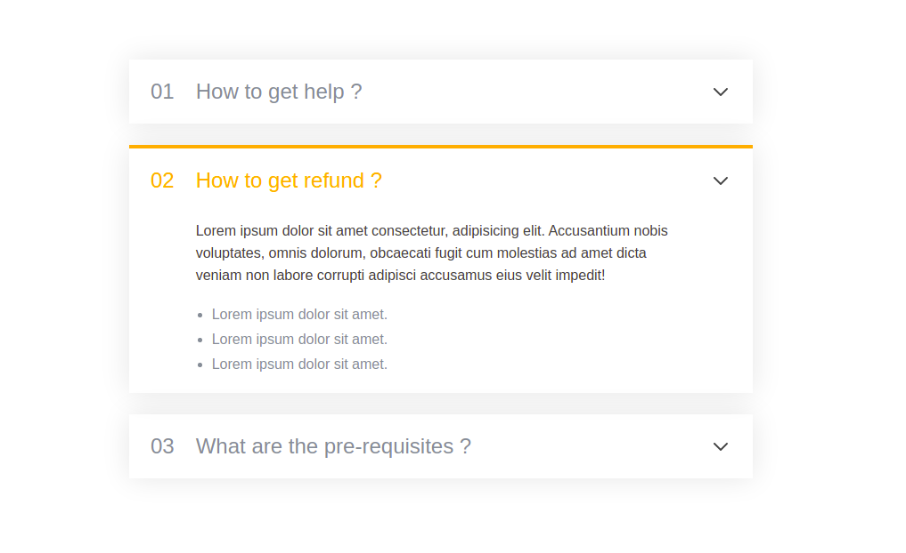
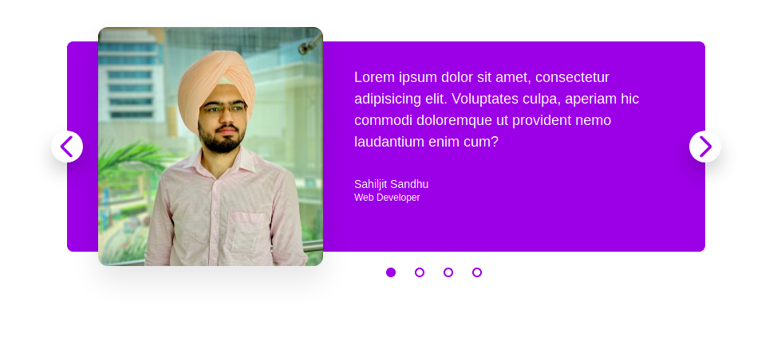

<h1> a2zCss </h1>

This is my CSS tool-kit. Various components like <i>form</i>, <i>accordian</i>, <i>table</i>, <i>carousel</i> which are used while building Web Apps are build here.

 

<h2>Tech Stack</h2>
<ul>
<li>JSX</li>
<li>CSS</li>
<li>Sass</li>
<li>Module CSS</li>
<li>Flexbox</li>
<li>CSS grid</li>
<li>React-Router</li>
<li>Material UI React</li>
</ul>

 

<h2>

Screenshots

</detials>
</h2>

 

<h2>Feedback</h2>
If you have any feedback, please reach out to me at <a href="https://www.sahiljit.com">sahiljit.com</a>

